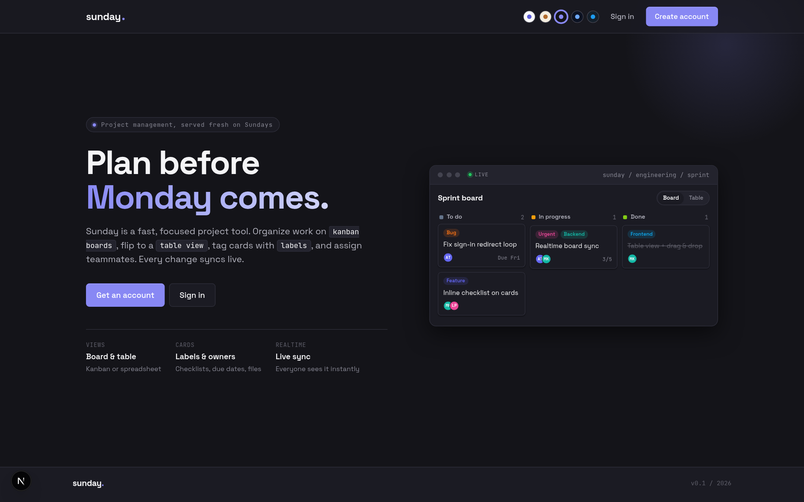
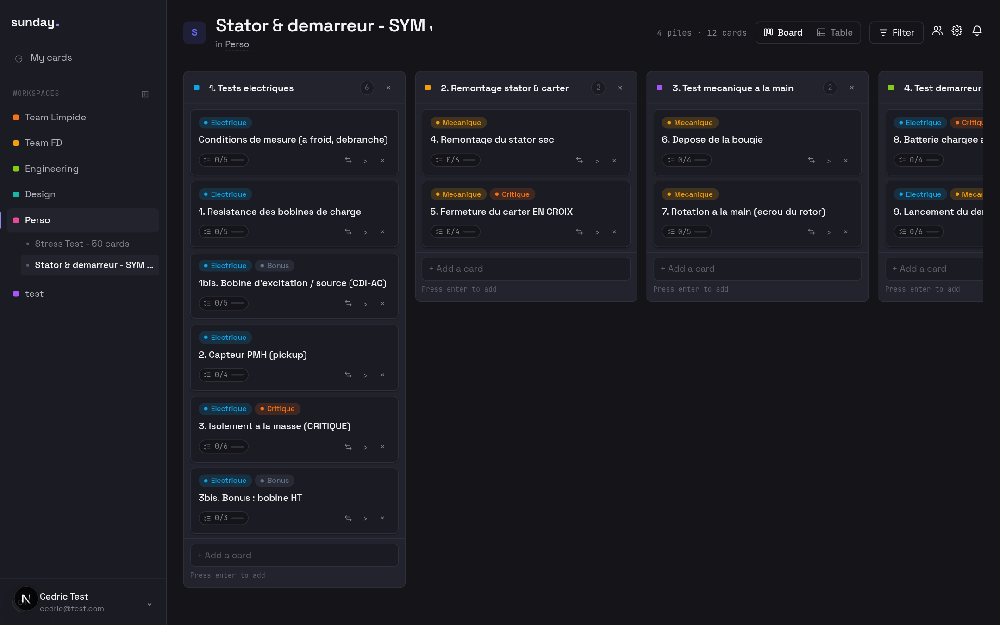
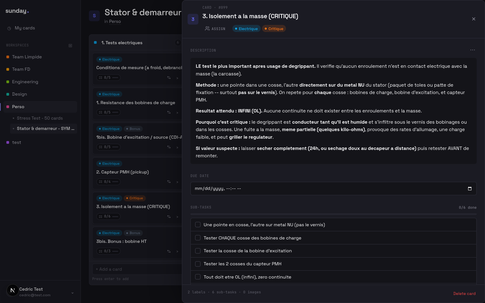
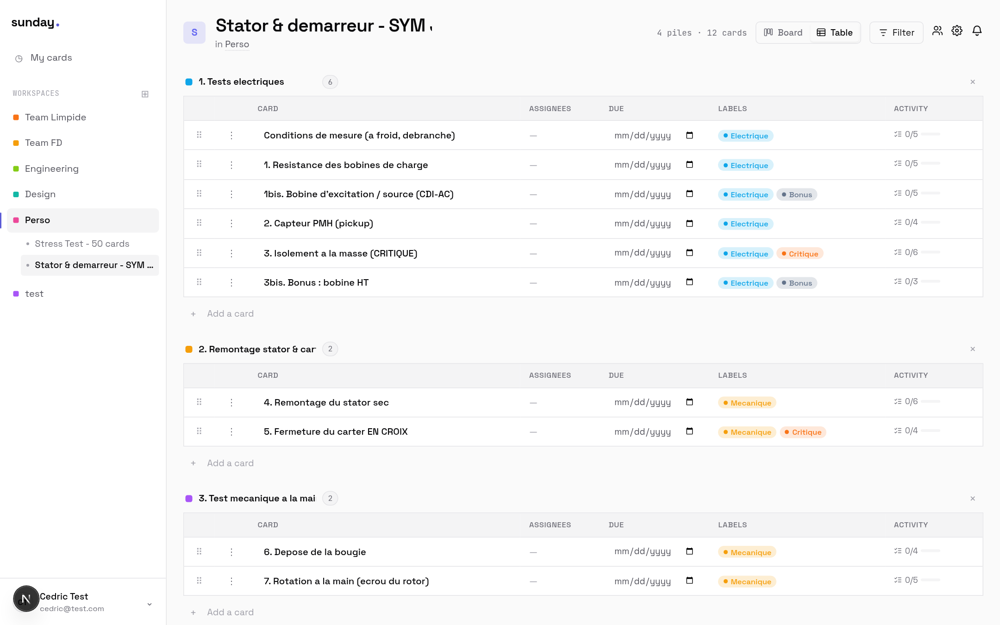

# Sunday


A small, fast, self-hostable project management tool — workspaces, boards,
kanban/table views, cards with labels, assignees, checklists, attachments and
comments, real-time sync, and an invite/auth system with email.

> Plan before Monday comes.

<p align="center">
  
</p>

---

## Screenshots

| Kanban board | Card detail |
| --- | --- |
|  |  |

| Table view | Light theme |
| --- | --- |
|  |  |

> Regenerate these with `bun run screenshots` (needs the app running locally).

---

## Table of contents

- [Screenshots](#screenshots)
- [Features](#features)
- [Tech stack](#tech-stack)
- [Quick start](#quick-start)
- [Environment variables](#environment-variables)
- [Scripts](#scripts)
- [Database & migrations](#database--migrations)
- [Email (dev & prod)](#email-dev--prod)
- [Project structure](#project-structure)
- [Architecture](#architecture)
- [Going to production](#going-to-production)
- [Scaling notes](#scaling-notes)

---

## Features

- **Workspaces → Boards → Cards** hierarchy.
- **Two board views**: kanban (drag & drop piles/cards) and an interactive table.
- **Cards**: title, rich description (headings, bold/italic, inline images),
  labels, assignees, due dates, checklists (sub-tasks), file attachments, and
  threaded comments with `@mentions`.
- **Real-time**: changes (card create/move/update/delete, pile changes, badge
  counts, comments) stream to other viewers over Server-Sent Events — no refresh.
- **Move without dragging**: a "move to pile" menu on every card, plus
  **multi-level undo** for cross-pile moves (toast button or `Ctrl/Cmd+Z`).
- **Roles & permissions**: two-tier RBAC (workspace caps + board caps).
- **Invitations** by email (workspace and board), token-based with expiry.
- **Auth**: email + password, password reset, email verification, account
  settings (name/email/password), rate-limited auth endpoints.
- **Notifications**: in-app bell + email on assign / comment / mention, with a
  deep link straight to the card.
- **Light & dark themes**.

## Tech stack

| Area | Choice |
|------|--------|
| Framework | Next.js 16 (App Router) + React 19, Turbopack |
| Language | TypeScript |
| Styling | SCSS modules + CSS variables (theming) |
| DB | MariaDB via Drizzle ORM (`mysql2`) |
| Auth | JWT session cookie (`jose`), bcrypt password hashing |
| Real-time | Server-Sent Events + in-process pub/sub |
| Storage | S3-compatible (MinIO in dev) or local disk |
| Email | SMTP via `nodemailer` (Mailpit in dev) |
| i18n | `next-intl` |
| Runtime / dev | Docker Compose, `bun` |

## Quick start

You need **Docker** installed. Everything (app, DB, object storage, mail
catcher) runs in containers.

```bash
# 1. Configure your environment
cp .env.example .env
#    then edit .env — at minimum set a strong JWT_SECRET:
#    openssl rand -base64 48

# 2. Start the whole stack (app + MariaDB + MinIO + Mailpit)
make start          # detached
# or
make start-f        # foreground (logs in your terminal)
```

Then open:

- App: <http://localhost:3000>
- Mailpit (captured emails in dev): <http://localhost:8025>
- MinIO console: <http://localhost:9001>

`make` with no target prints all available commands.

## Environment variables

All config lives in `.env` (loaded by Next.js and Docker Compose). See
[`.env.example`](./.env.example) for the full, documented list. Highlights:

| Variable | Purpose |
|----------|---------|
| `JWT_SECRET` | **Required.** Session signing key. The app refuses to boot in production if it's the placeholder or `< 32` chars. |
| `APP_URL` | Public base URL used to build links in emails. |
| `DB_*` | MariaDB connection. |
| `SMTP_*`, `MAIL_FROM` | Outbound email. Dev points at the Mailpit container. |
| `S3_*`, `STORAGE_DRIVER` | Attachment storage (`s3` or `local`). |

## Scripts

```bash
bun run dev          # dev server (used by the app container)
bun run build        # production build
bun run start        # start the production build
bun run lint         # eslint

bun run db:generate  # generate a migration from src/db/schema.ts
bun run db:migrate   # apply pending migrations
bun run db:studio    # Drizzle Studio (DB browser)
```

> When running `db:*` from the host, set `DB_HOST=localhost` (Compose publishes
> port 3306). Inside the app network the host is `db`.

## Database & migrations

The schema is defined in [`src/db/schema.ts`](./src/db/schema.ts) and managed
with **Drizzle Kit**. Migrations live in [`drizzle/`](./drizzle).

```bash
# After editing src/db/schema.ts:
bun run db:generate     # writes drizzle/NNNN_*.sql
bun run db:migrate      # applies it
```

A fresh database is bootstrapped from the baseline migration
(`drizzle/0000_baseline.sql`), verified to create the full schema. The existing
dev database is already baselined in `__drizzle_migrations`, so `db:migrate` is
a no-op there.

> ⚠️ The live database carries a few performance indexes that are not yet
> declared in `schema.ts`. A brand-new DB created purely from migrations will be
> missing them — see [docs/DEPLOYMENT.md](./docs/DEPLOYMENT.md).

## Email (dev & prod)

- **Dev**: the `mailpit` container captures every outgoing email — nothing is
  actually sent. Browse them at <http://localhost:8025>.
- **Prod**: point `SMTP_*` at a real provider, set `MAIL_FROM` and `APP_URL`,
  and configure **SPF/DKIM/DMARC** on the sending domain. Do **not** run Mailpit
  in production.

Email is always **best-effort** — a delivery failure never breaks the action
that triggered it (invite, signup, notification).

## Project structure

```
src/
  app/
    [locale]/            # localized pages (App Router)
      boards/[id]/       # board view: kanban + table, card drawer
      workspaces/        # workspace list + AppShell (sidebar, profile menu)
      users/             # sign in/up, forgot/reset password, verify email
      me/                # my cards, account settings
    api/                 # route handlers (auth, boards, cards, invites, …)
  components/            # atoms / molecules / organisms (UI)
  db/                    # schema.ts + Drizzle client
  lib/                   # server logic: auth, RBAC, realtime buses, mail, …
  messages/              # i18n translations
docker/                  # Dockerfile + docker-compose.yml
drizzle/                 # generated migrations
docs/                    # architecture & deployment docs
```

## Architecture

See [docs/ARCHITECTURE.md](./docs/ARCHITECTURE.md) for details on the RBAC
model, the real-time SSE buses, storage/email abstractions, and auth/token
flows.

## Going to production

Read [docs/DEPLOYMENT.md](./docs/DEPLOYMENT.md) — it covers the **hard
requirements** (real secrets, HTTPS, `NODE_ENV=production`, real SMTP,
migrations) and a production checklist.

## Scaling notes

The app is **single-instance** today and comfortably serves a launch (hundreds
to low thousands of concurrent users) on one decent server. It is **not** yet
built for horizontal scale — the real-time pub/sub and rate limiter are
in-process. The path to scale (Redis pub/sub, a job queue, read replicas) is
documented in [docs/DEPLOYMENT.md](./docs/DEPLOYMENT.md#scaling-roadmap). Don't
build it before metrics demand it.

## Contributing

Contributions are welcome! See [CONTRIBUTING.md](./CONTRIBUTING.md) for the dev
setup, conventions, and the migration workflow, and please follow the
[Code of Conduct](./CODE_OF_CONDUCT.md). Bug reports and feature requests go
through the issue templates.

## License

[MIT](./LICENSE) © Cedric Rabarijohn
